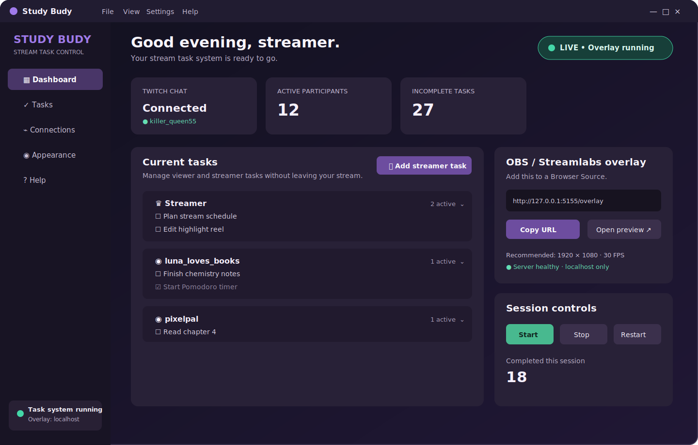

# Study Budy Desktop

Study Budy is a Windows-first desktop task manager for Twitch study, coworking, productivity, and body-doubling streams. It gives streamers a local OBS or Streamlabs Desktop Browser Source overlay and a desktop control panel for streamer and viewer tasks.



## Current foundation

- Native PySide6 desktop window with Dashboard, Tasks, Connections, Appearance, and Help screens.
- SQLite-backed participant, task, completion, ordering, settings, backup, export, and import data.
- One-time migration of the prototype `data/tasks.json` file.
- Local-only (`127.0.0.1`) Browser Source overlay with Cycling and Streamer-on-top layout modes.
- Overlay URL copying, preview, start/stop/restart controls, and explicit status text.
- Appearance settings for layout, cycle time, font, text/background color, and opacity.
- Preserved Twitch command grammar: `!addtask`, `!tasklist`, `!done`, and `!clear`.

## Quick start for developers

Study Budy requires Python 3.11 or newer. See [Windows build instructions](docs/WINDOWS-BUILD.md).

```powershell
python -m venv .venv
.\.venv\Scripts\Activate.ps1
python -m pip install -r requirements.txt
python -m study_budy.main
```

## OBS and Streamlabs Desktop

Start the task system, copy the `http://127.0.0.1:5155/overlay` URL, and add it as a Browser Source. Use 1920 × 1080 at 30 FPS as a starting point, then resize it in your scene. The overlay background is transparent outside its task cards.

## Data, backups, and privacy

Application data is stored under `%LOCALAPPDATA%\Study Budy`. Export task data with **File → Export tasks**. The Browser Source binds only to localhost by default. Never place Twitch tokens or client secrets in source files or commits.

## Current limitations

- Twitch OAuth/device authorization, resilient chat reconnection, and optional OBS WebSocket integration are the next integration phase.
- Image upload/asset controls, advanced rollover choices, and an installer definition remain to be added.
- The legacy prototype Flask endpoints remain for compatibility while the new local overlay service is adopted.

See [the architecture audit and implementation plan](docs/architecture-audit.md) for the original prototype assessment and phased plan.
